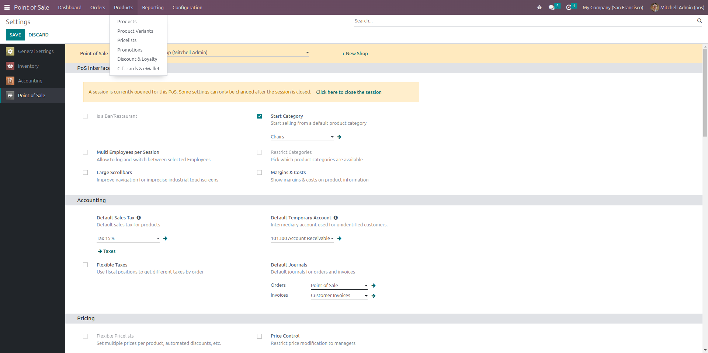
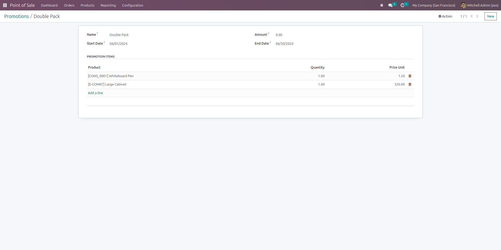
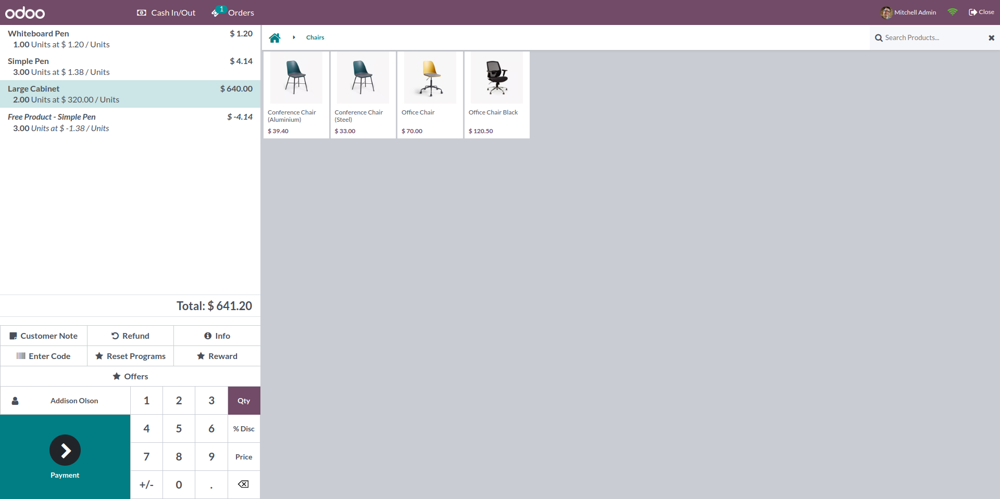
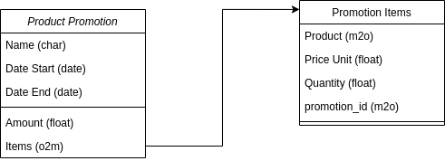

# One Acre Fund 

A module that can be installed into an Odoo instance that demonstrates the following functionality:
Create an offer 
Configure the offer to contain one or more products
Set a price for the offer
Set a date range that the offer is valid
The Point of Sale module should display valid offers with their associated prices and allow them to be ordered (BONUS: The receipt shows not only the offer name, but also the list of products included in the offer).


## Installation

In the project folder run the following command to spawn a version 16 odoo community instance
Depending on your docker compose version you might need to run (`docker-compose instead of docker compose`)

```bash
docker compose up
```

## Usage
1. Open odoo apps and search for pos_promo and click on activate


2. Open Point of Sale module /products and select promotions window


3. Create a new promotion setting the products to be offered and the quantity offered


4. On Pos Session, click on offers to add a new offer



## Design Docs



## Improvement Cases.
1. Option to automatically / manually apply the promotion.
2. Mutilple promotion types (Discount, Buy X get Y, Coupons)
3. Limit usage to different pos configs/shops
4. In cases where we're giving out items, include a loss chart of accounts to track promotion costs.

## License

[MIT](https://choosealicense.com/licenses/mit/)

